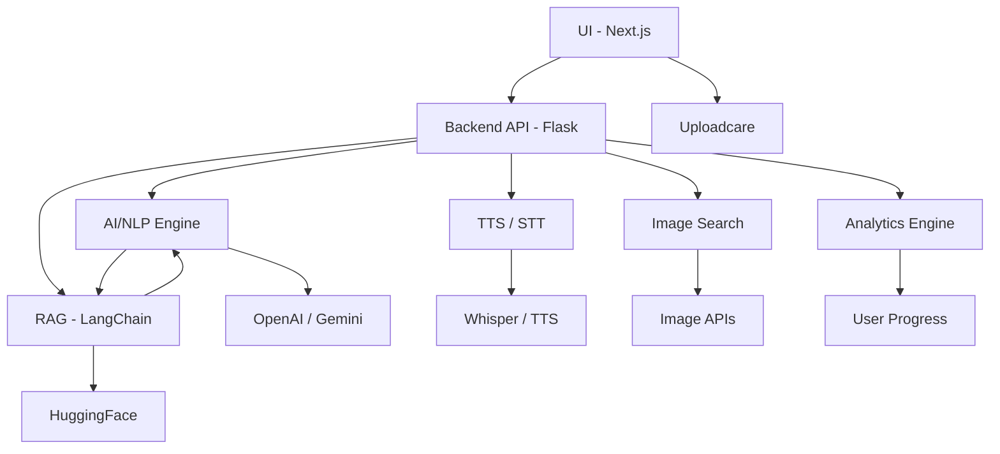

# Tayyari.ai

**Tayyari.ai** is an advanced, adaptive learning companion that transforms any educational content—PDFs, slides, notes, and videos—into interactive, personalized learning experiences. Harnessing state-of-the-art AI, Tayyari.ai enables learners to study smarter, not harder, with instant content conversion, AI-driven quizzes, adaptive learning paths, and rich multimodal accessibility.

---

## 🎯 Vision

Tayyari.ai aims to democratize high-quality, personalized education by making it accessible, interactive, and effective for everyone.  
Whether you're self-studying, preparing for exams, or exploring new topics, Tayyari.ai adapts to your pace, style, and goals—empowering you to learn **anything, your way**.

---

## 🏗️ System Architecture



- **A:** User interacts with Tayyari.ai via a modern Next.js frontend (chat, upload, quizzes).
- **B:** All requests are processed by a Python Flask backend API.
- **G:** Uploadcare is used for secure file uploads.
- **C:** AI/NLP engine processes user input, generates summaries, flashcards, and quizzes.
- **D:** Retrieval-Augmented Generation (RAG) module (LangChain) fetches context from your notes and external sources.
- **E:** Text-to-Speech and Speech-to-Text modules provide multimodal accessibility.
- **F:** Real-world images are fetched from Unsplash/Bing based on learning topics.
- **H:** Analytics engine tracks progress and learning metrics.
- **I/J/K/L/M:** External AI/ML APIs and services for advanced capabilities.

---

## ✨ Features

- **📂 Upload & Convert Resources**  
  Upload PDFs, PowerPoint slides, or videos and instantly convert them into structured, interactive study modules.

- **🧠 AI-Powered Concept Understanding**  
  AI analyzes your uploaded content, extracts key concepts, and generates concise summaries, visual diagrams, and knowledge maps.

- **📑 Automated Summaries & Flashcards**  
  Get clear, concise summaries and AI-generated flashcards for fast review and spaced repetition.

- **✍️ Interactive Quizzes**  
  Reinforce your understanding with context-aware, AI-generated quizzes—each with explanations, diagrams, and real-world images.

- **🎯 Adaptive Learning Paths**  
  Tayyari.ai dynamically adjusts content difficulty and presentation based on your quiz performance and feedback, ensuring a personalized learning curve.

- **🔎 Retrieval-Augmented Generation (RAG)**  
  Combines your uploaded content with trusted external sources for accurate, contextual answers and explanations.

- **🎮 Gamification & Progress Tracking**  
  Earn achievements, badges, and see detailed analytics of your learning journey.

- **🖼️ Real-world Visuals & Diagrams**  
  For every concept, Tayyari.ai provides both AI-generated diagrams and relevant real-world images pulled from trusted sources (e.g., Unsplash, Bing) for richer understanding.

- **🎙️ Multimodal AI Accessibility**  
  - **Text-to-Speech:** Listen to notes, summaries, and answers.
  - **Speech-to-Text:** Speak your questions or notes directly.
  - **Multimodal chat:** Text, voice, and file-based interactions.

- **🤖 Information Integrity & Decision Support**  
  Mitigates misinformation and provides context-aware, reliable insights for research and learning.

- **🧩 Seamless User Experience**  
  Consistent, modern UI/UX with beautiful gradients and glassmorphism, matching the landing and chat pages for a cohesive experience.

---

## 🛠️ Tech Stack

- **Frontend:**  
  - React (Next.js)
  - Framer Motion (animations)
  - Tailwind CSS (styling)
  - React Markdown + KaTeX (math rendering)
  - Uploadcare (file uploads)

- **Backend:**  
  - Python (Flask)
  - LangChain (document parsing, RAG)
  - PDF/Text/Video parsing modules
  - HuggingFace transformers (NLP)

- **AI & NLP:**  
  - OpenAI (GPT models via GitHub API)
  - Gemini API (Google AI)
  - Custom Retrieval-Augmented Generation (RAG) pipeline
  - Whisper (Speech-to-Text)
  - Deep Learning Text-to-Speech (TTS)

- **Integrations:**  
  - Unsplash/Bing for real-world images
  - Sonner (notifications)
  - GitHub Copilot (coding assistance)

---

## 🚀 Getting Started

### 1. **Clone the repository**
```bash
git clone https://github.com/<your-username>/tayyari-ai.git
cd tayari-ai
```

### 2. **Install dependencies**

- **Frontend:**
  ```bash
  cd app
  npm install
  ```

- **Backend:**
  ```bash
  cd backend
  pip install -r requirements.txt
  ```

### 3. **Set up environment variables**

- Frontend (`.env.local`):
  ```
  NEXT_PUBLIC_UPLOADCARE_PUBLIC_KEY=your_uploadcare_public_key
  NEXT_PUBLIC_BING_IMAGE_SEARCH_KEY=your_bing_key # If using Bing
  ```

- Backend (`.env`):
  ```
  GEMINI_API_KEY=your_gemini_api_key
  GITHUB_TOKEN=your_github_openai_token
  ```

### 4. **Run the app**

- **Backend:**
  ```bash
  cd backend
  python app.py
  ```

- **Frontend:**
  ```bash
  cd app
  npm run dev
  ```

---

## 📚 Usage Guide

1. **Upload** your notes, PDFs, slides, or videos.
2. **Add notes or questions** in natural language—text or voice.
3. **Explore**: Instantly receive summaries, quizzes, and diagrams.
4. **Take interactive quizzes** with real-world images and explanations.
5. **Track your progress** and revisit past conversations via the Recent Learning section.

---

## 🖼️ Visuals & Multimodal Learning

- Every chat response includes:
  - A big, bold heading with an AI-generated diagram.
  - A real-world image relevant to the topic (via Unsplash/Bing).
  - Concise bullet-point explanations.
  - Interactive "Learn More" and "Take Quiz" actions.

---

## 🗂 Project Structure

```
/
├── app/                # Next.js frontend (chat, upload, landing, etc.)
├── backend/            # Flask backend (AI, RAG, TTS, STT)
├── public/             # Static assets
├── README.md
└── ...
```

---

## 🚦 Roadmap

- 🌎 **Multilingual Support** — Learn in your language of choice.
- 🤝 **Collaborative Learning** — Group study sessions and shared workspaces.
- 🎨 **UI Customization** — Personalize themes, layouts, and interaction modes.
- 🕵️ **Advanced Research Tools** — Deeper document/contextual analysis.
- 📊 **Analytics & Insights** — Detailed learning analytics and recommendations.

---

## 🖥️ Demo Video

[Watch the demo](https://drive.google.com/file/d/1UFxwsn_B1ucXtvMGAMOtNFW0qk1Lr0NM/view?usp=drive_link)

---

## 🙏 Contributing

Pull requests are welcome!  
If you have suggestions for new features, improvements, or bug fixes, please open an issue or submit a PR.

---

## 📄 License

This project is licensed under the MIT License - see the LICENSE file for details.

---

**Tayyari.ai** — Learn anything. Your way.  
Smarter, faster, more interactive learning for everyone.
